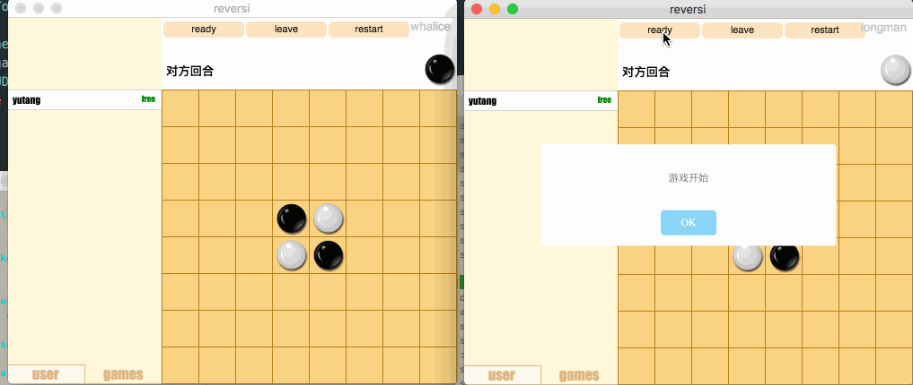
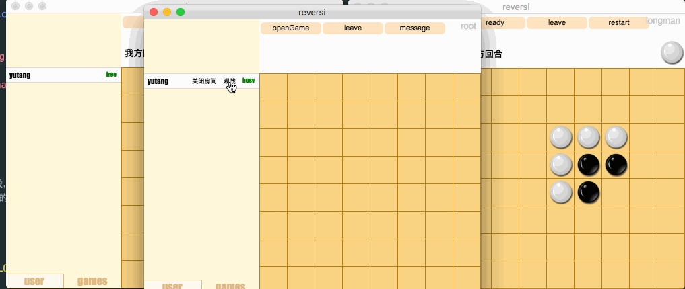

### 
黑白棋设计文档

###### 
Eric

#### 总体说明
- [Release](https://github.com/erichuang1994/Reversi-Client/releases)
- `一些截图`:
  

  

### 协议说明

#### 总的说明:
- 协议用空格隔开各个字段，并且第一个字段都表明了命令的类型，对于从client发往server的命令最后都带上自己的token(登录除外),server返回的报文的第一个字段也是表明了回复命令的类型。

#### 具体的说明
- `login`:
  - `client发送`:`LOGIN USERNAME (PASSWORD)`仅有管理员登录需要附上密码
  - `client接收`:
    - 管理员:`(ROOT ROOTTOKEN/LOGIN FAILED)`
    - 玩家:`LOGIN SUCCESS`
- `msg`:管理员发送信息

	- `client发送`(只有管理员能用):`MSG (USERNAME) MESSAGE ROOTTOKEN`

  - Server接收后依照命令长度(判断是群发还是发给一个人)以及USERNAME的值判断该群发还是发给某个用户信息

  - `client接收`:`MSG MESSAGE`

- `list`:获取在线玩家列表以及状态
  - `client发送`:`LIST TOKEN`
  - `client接收`: `LIST USERNAME (free/room:roomname) `(若有多个在线用户则(USERNAME (free/room:roomname))就重复多少次。free代表空闲room:roomname代表他在房间roomname中)

- `kickout`:管理员踢人

	- `client发送`:`KICKOUT USERNAME ROOTTOKEN`(该命令仅有管理员可以发送)

  - `client接收`:`KICKOUT USERNAME`
  - 接受到该命令的客户端会判断username是不是自己而选择提示信息。
- `opengame`:管理员创建房间
	- `client发送`:`OPENGAME GAMENAME ROOTTOKEN`(该命令仅有管理员可以发送)

  - `client接收`:`OPENGAME (SUCCESS/FAIL)`
- `games`:获取房间列表
	- `client发送`:`GAMES Token`  

  - `client接收`:`GAMES GAMENAME (free/busy)`(若有多个房间存在则(GAMENAME (free/busy))就重复多少次。free代表空闲busy表示房间中已经有两名玩家)
- `watch`:管理员观战

	- `client发送`:`WATCH GAMENAME ROOTTOKEN`

  - `client接收`:`WATCH (SUCCESS BOARDSTR/FAIL)`(FAIL表示观战失败，这说明房间还没有正在进行游戏,SUCCESS表明观战成功，并且BOARDSTR是整个棋盘的状态(用长度为64的字符串表示))

- `closegame`:管理员关闭房间

	- `client发送`:`CLOSEGAME GAMENAME ROOTTOKEN`

  - `client接收`(管理员):`CLOSE GAMENAME SUCCESS`

  - `client`(用户):`CLOSE`,如果房间中用户则向用户发出`CLOSE`命令
- `yourturn`:服务器通知谁走下一步棋
	- `client接收`:`YOURTURN `说明该本client走棋了
- `move`:
	- `client发送`:`MOVE GAMENAME X Y COLOR TOKEN`该命令仅在接收到服务器通知其走的命令之后才允许发送,留意到这里信息有点冗余(Server根据TOKEN即可知道GAMENAME与COLOR，不过为了处理方便，还是这样吧)

  - `client接收`:`MOVE X Y COLOR`仅有当client接收来自服务器的MOVE命令时棋盘才会真正更新。
  - 当server在某次move之后发现游戏已经决出胜负了就会在MOVE后紧接着发送`GAMEOVE USER1 defeat USER2`.否则则是发送下一个`YOURTURN`命令
- `join`:
  - `client发送`:`JOIN GAMENAME TOKEN`

  - `client接收`:`JOIN GAMENAME (FAIL/SUCCESS)`
- `ready`:客户端发出准备命令
  - `client发送`:`READY  TOKEN`

  - `client接收`:`READY (SUCCESS/FAIL)`当已经准备过了会返回准备失败
- `start`:服务器通知游戏开始
	- `client接收`:`START COLOR`通知游戏开始，COLOR决定client应该执什么颜色的棋子,本命令会在双方都准备的时候立即发送
- `restart`:请求重新开始游戏
  - `client发送`:`RESTART TOKEN`

  - `client接收`(请求重开):`RESTART REQUEST`这是发给另一位玩家的命令，若是他也接收了则双方会收到

  - `client接收`(重开成功):`RESTART SUCCESS`之后会按照正常游戏开始流程

- `leave`:

	- `client发送`:`LEAVE TOKEN`

  - `client接收`:`LEAVE USERNAME`USERNAME为离开游戏的玩家的名字(管理员离开不会通知)
