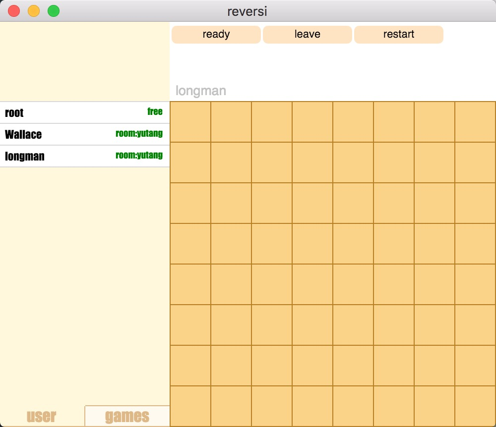

### 
黑白棋设计文档

###### 
13307130251 黄伟俊

#### 总体说明
- `开发环境`:OS X EI Capitan
- `语言`:golang(server),Node.js(client)
- `代码编译方法`:
  - golang在server项目主目录下go build即可
  - Node.js需要安装electron(v0.35.2)以及babel(5.8.20 (babel-core 5.8.34))(如果你需要重新修改es6代码的话),在项目主目录下首先npm install安装依赖，然后npm run build把es5转成es5(如果你改过es6文件),最后npm run start运行程序,如果需要打包程序执行npm run pack(默认三个平台都打包一次,输出在out文件夹下)
- `执行方法`:
  - `server`:在终端下(unix)执行即可(server端目前没有widnwos版本若需要请自行编译（未尝试过))
  - `client`:双击执行
- `一些截图`:
  - `登录界面`:
  
  - `登录失败`:
  
  - `管理员登录成功`(用户名在右上角):
  
  - `创建房间`:
  
  - `发送信息`:
  
  - `观战,关闭房间`(鼠标移到房间上面就会显示):
  
  - `加入房间`(鼠标移到房间上面就会显示):
  
  - `用户状态`(每次点击左下角的user时会更新，暂时不会自动更新):
  
  - `游戏开始`(双方加入同一个房间且准备后游戏就会开始):
  
  - `正在游戏`:
  
  - `请求重开`:
  
  - `不能走的地方有提示`:
  
  - `观战`(对于正在进行游戏的房间可以进行观战):
  
  - `管理员发送命令`(即msg命令):
  
  - `踢出玩家`(即kickout,将鼠标移到user栏上想要踢出的玩家名字上即会出现踢出选项):
  
- `流程说明`: 管理员和普通玩家都通过client登录,server维护游戏运行逻辑(合法性，当前轮到谁走等),处理各种指令。客户端预先处理掉非法的步子，并且总是在收到服务器允许走的指令之后才走。暂时只支持一个玩家同时在一个房间里最多进行一场游戏。

#### 较为详细的说明
- `Server`：Server端使用了golang编写，保证了良好的并发性与服务器性能,默认端口为3106。golang代码分成三个package,main,hanlder和game.其中main为主控函数，handler为命令处理package,game为游戏逻辑package.具体内容见源代码以及注释（有少量注释),由于server端并不会主动发信息(除了120s会发送一次心跳包以及通知下一步应该谁走).所以协议的详细说明留在client处.

- `Client`:Client使用了Node.js+electron编写，同时使用了angular,将数据与UI很好的分离开来,并且由于使用了electron,可以生成三平台的执行程序(windows,os x,linux)(由于上传附件大小限制并且我也只在os x下测试过，所以我只上传了os x版本，若需要其他版本可以自行打包或者给我发[email](13307130251@gmail.com)),并且可以很方便的用写网页的方法来写naive app,同时使js与本地资源的交互(发送UDP报文)变得方便。管理员和玩家都从Client登录，管理员默认帐号密码分别为root,root.管理员登录之后就可以进行创建房间，关闭房间，发送通知信息，观战，踢人等操作。玩家登录之后则可以进行加入房间，开始游戏等操作。

### 协议说明

#### 总的说明:
- 协议用空格隔开各个字段，并且第一个字段都表明了命令的类型，对于从client发往server的命令最后都带上自己的token(登录除外),server返回的报文的第一个字段也是表明了回复命令的类型。

#### 具体的说明
- `login`:
  - `client发送`:`LOGIN USERNAME (PASSWORD)`仅有管理员登录需要附上密码
  - `client接收`:
    - 管理员:`(ROOT ROOTTOKEN/LOGIN FAILED)`
    - 玩家:`LOGIN SUCCESS`
- `msg`:管理员发送信息

	- `client发送`(只有管理员能用):`MSG (USERNAME) MESSAGE ROOTTOKEN`

  - Server接收后依照命令长度(判断是群发还是发给一个人)以及USERNAME的值判断该群发还是发给某个用户信息

  - `client接收`:`MSG MESSAGE`

- `list`:获取在线玩家列表以及状态
  - `client发送`:`LIST TOKEN`
  - `client接收`: `LIST USERNAME (free/room:roomname) `(若有多个在线用户则(USERNAME (free/room:roomname))就重复多少次。free代表空闲room:roomname代表他在房间roomname中)

- `kickout`:管理员踢人

	- `client发送`:`KICKOUT USERNAME ROOTTOKEN`(该命令仅有管理员可以发送)

  - `client接收`:`KICKOUT USERNAME`
  - 接受到该命令的客户端会判断username是不是自己而选择提示信息。
- `opengame`:管理员创建房间
	- `client发送`:`OPENGAME GAMENAME ROOTTOKEN`(该命令仅有管理员可以发送)

  - `client接收`:`OPENGAME (SUCCESS/FAIL)`
- `games`:获取房间列表
	- `client发送`:`GAMES Token`  

  - `client接收`:`GAMES GAMENAME (free/busy)`(若有多个房间存在则(GAMENAME (free/busy))就重复多少次。free代表空闲busy表示房间中已经有两名玩家)
- `watch`:管理员观战

	- `client发送`:`WATCH GAMENAME ROOTTOKEN`

  - `client接收`:`WATCH (SUCCESS BOARDSTR/FAIL)`(FAIL表示观战失败，这说明房间还没有正在进行游戏,SUCCESS表明观战成功，并且BOARDSTR是整个棋盘的状态(用长度为64的字符串表示))

- `closegame`:管理员关闭房间

	- `client发送`:`CLOSEGAME GAMENAME ROOTTOKEN`

  - `client接收`(管理员):`CLOSE GAMENAME SUCCESS`

  - `client`(用户):`CLOSE`,如果房间中用户则向用户发出`CLOSE`命令
- `yourturn`:服务器通知谁走下一步棋
	- `client接收`:`YOURTURN `说明该本client走棋了
- `move`:
	- `client发送`:`MOVE GAMENAME X Y COLOR TOKEN`该命令仅在接收到服务器通知其走的命令之后才允许发送,留意到这里信息有点冗余(Server根据TOKEN即可知道GAMENAME与COLOR，不过为了处理方便，还是这样吧)

  - `client接收`:`MOVE X Y COLOR`仅有当client接收来自服务器的MOVE命令时棋盘才会真正更新。
  - 当server在某次move之后发现游戏已经决出胜负了就会在MOVE后紧接着发送`GAMEOVE USER1 defeat USER2`.否则则是发送下一个`YOURTURN`命令
- `join`:
  - `client发送`:`JOIN GAMENAME TOKEN`

  - `client接收`:`JOIN GAMENAME (FAIL/SUCCESS)`
- `ready`:客户端发出准备命令
  - `client发送`:`READY  TOKEN`

  - `client接收`:`READY (SUCCESS/FAIL)`当已经准备过了会返回准备失败
- `start`:服务器通知游戏开始
	- `client接收`:`START COLOR`通知游戏开始，COLOR决定client应该执什么颜色的棋子,本命令会在双方都准备的时候立即发送
- `restart`:请求重新开始游戏
  - `client发送`:`RESTART TOKEN`

  - `client接收`(请求重开):`RESTART REQUEST`这是发给另一位玩家的命令，若是他也接收了则双方会收到

  - `client接收`(重开成功):`RESTART SUCCESS`之后会按照正常游戏开始流程

- `leave`:

	- `client发送`:`LEAVE TOKEN`

  - `client接收`:`LEAVE USERNAME`USERNAME为离开游戏的玩家的名字(管理员离开不会通知)
